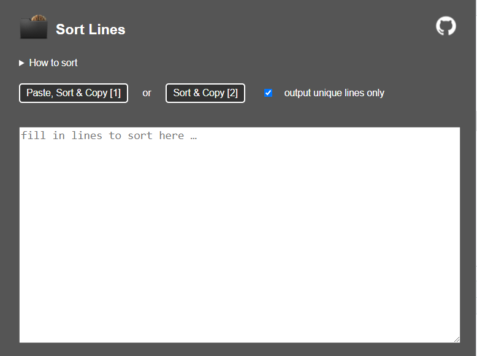

# Sort Lines

With this tool you can sort newline separated lines alphabetically.

You can either push the button "Paste, Sort & Copy" where the clipboard content is used as content or fill in your lines into textarea and push the button "Sort & Copy". In both cases the sorted result will be put back to clipboard.

If you leave the default option "output unique lines only" set all lines existing more then once are deleted.

There are two shortcuts to access the tool:
* 1: Paste, Sort & Copy
* 2: Sort & Copy
